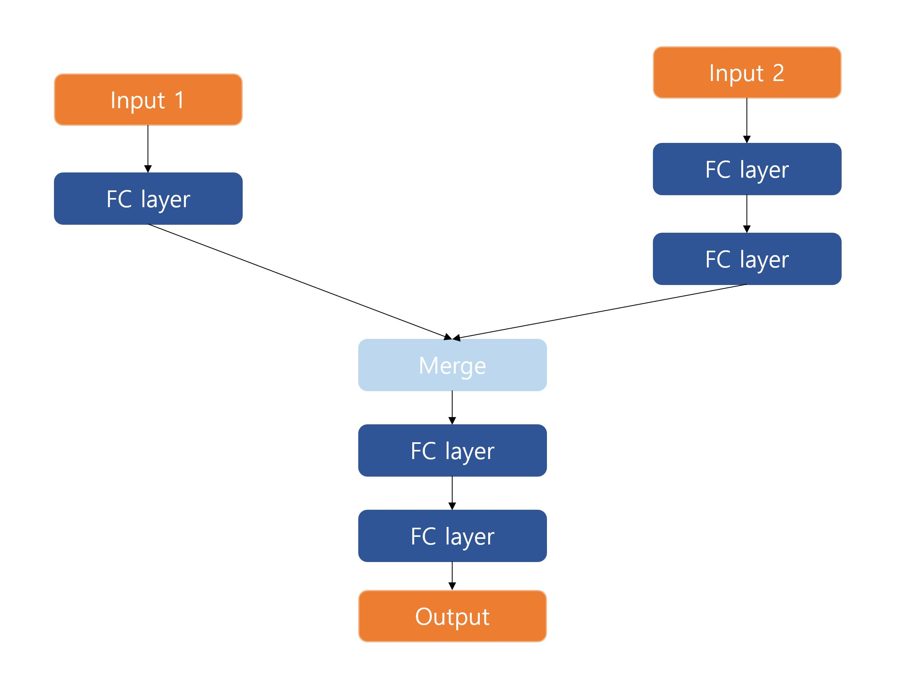
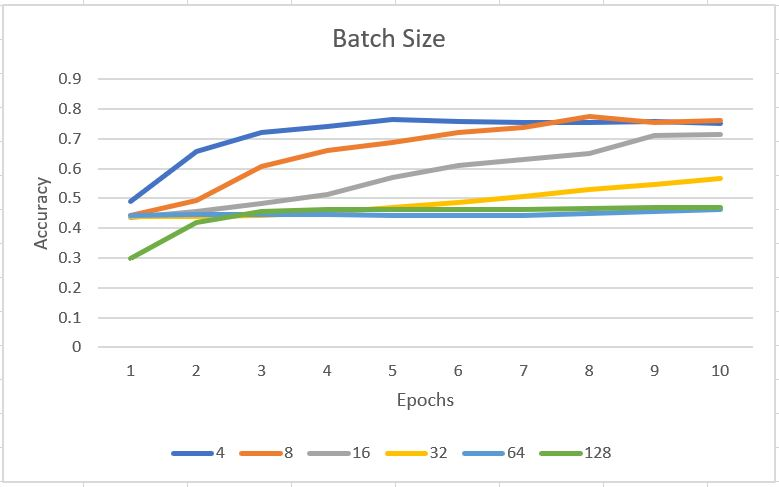
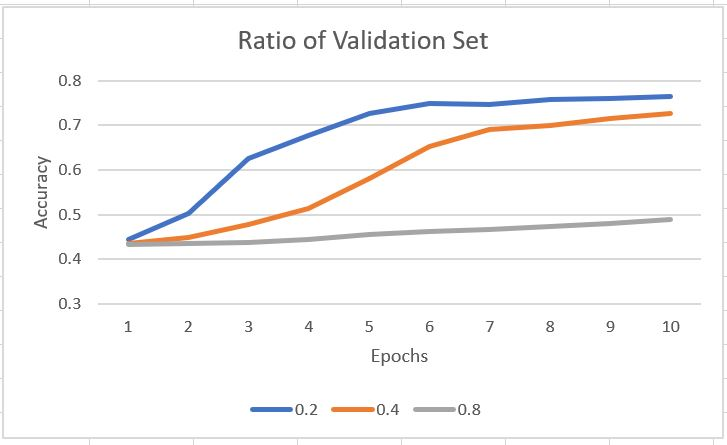

# Genome-Detection
This project is for detecting cancer type in DNA sample with machine learning  (Graduate Course Project in High Performance Computing)

There is Dataset which is named by "TCGA_6_Cancer_Type_Mutation_List", which has columns, 

    Cancer Type : There is 7 types(1 dummy type) of cancer.
 
    Tumor Sample ID : There are 2284 samples, which each sample has one cancer type. 
                      Each sample can have several genes. Therefore there could be more than one tuples in dataset.

    Gene Name : There are 20473 types of genes in dataset, each gene can be in several sample with different invariant type. 
                It would be the standard when processing the data.

    Chromosome : Chromosome that gene are located in. 
 
    Start Position : Start position of gene in chromosome.

    End Position : End position of gene in chromosome.

    Variant Type : Type of variance which is occured by certain gene, it has diverse types but we only concentrate on insert/delete types.

    Reference Allele : Original types of allele.

    Tumor Allele : Allele which is transformed by variance.

I transformed Dataset into simple. I used all columns except information related to location. (Start/End Position, Chromosome)

First, I transformed dataset into simple dataset which includes only two types, Cancer Type and Tumor Sample ID.

Then make two dictionaries, 

    sample_gene : It is dictionary which Tumor Sample ID is the key and the value will be the gene list
                  which is in the Tumor Sample ID

    sample_variant : It is dictionary which Tumor Sample ID is the key and the value will be the gene list
                     which is critical to cancer occurance

After data processing, I dumped these two dictionaries into json file. 

Then shuffle the dataset because the dataset is formed as one type by one type, so there is possibility for not well training. 

Third, make neural network which will be trained by shuffled data and two dictionaries. 

The neural network has two inputs,

    sample_gene

    sample_variant

The output will be,

    Predicted Cancer Type

The configuration of neural network is like below :
 

    

I got the best results(accuracy) when configuration is below,

20 epochs with 0.2 validation split and batch size 8. 

I made experiment with rate of validation split and batch size.

First, I trained the model with diverse batch size.

    

Second, I trained the model with diverse rate of validation split. 

    

** Term definition related to biology could be wrong in some aspects.  :>
